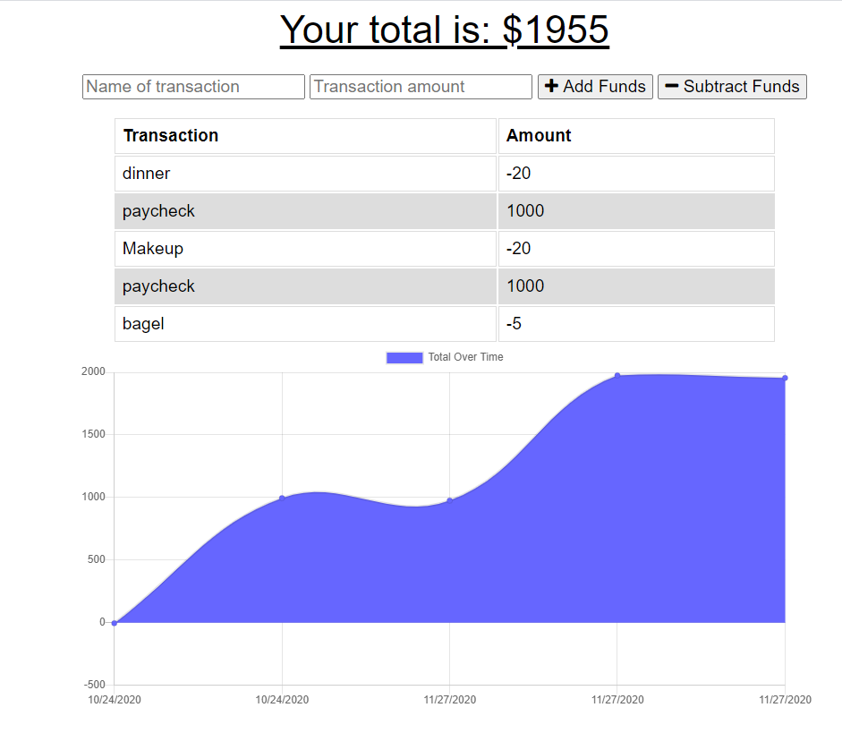

# Budget Tracker

> AS AN avid traveller 
  I WANT to be able to track my withdrawals and deposits with or without a data/internet connection 
  SO THAT my account balance is accurate when I am traveling.

---

### Table of Contents

- [Description](#description)
- [Technologies](#technologies)
- [How To Use](#how-to-use)
- [License](#license)
- [Author Info](#author-info)

---

## Description

Giving users a fast and easy way to track their money is important, but allowing them to access that information anytime is even more important. Having offline functionality is paramount to our applications success.

### Technologies

- JavaScript
- Node.js
- Service workers
- Mongoose
- MongoDB
- Express
- Morgan
- HTML
- CSS

## How to Use

Npm install all your dependencies, type in node server.js to launch, the App is listening on http://localhost:3300/. Enter your transactions, the graph will update with each new transaction.

### License

Distributed under the MIT License. See LICENSE for more information.

[Back To The Top](#budget-tracker)

---

## Author Info

Fatim Robbins
fmsis@hotmail.com
 
Heroku link - https://fatimrobbinsbudgettracker.herokuapp.com/
Github link - https://melodie15.github.io/fatimrobbins.budgettrackers.github.io/
